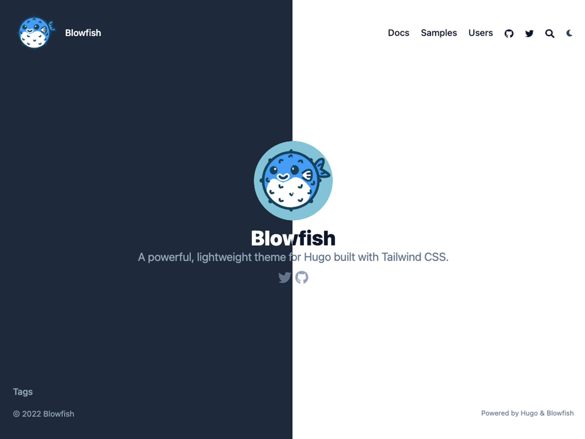
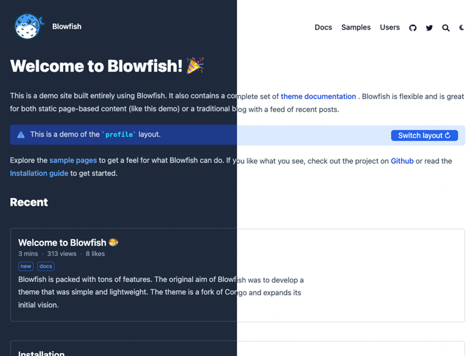
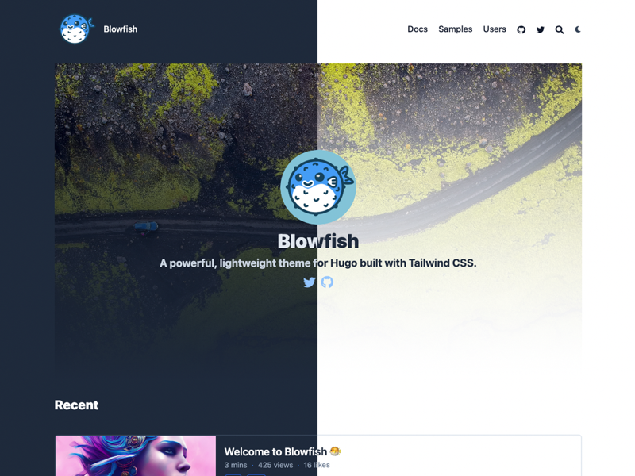
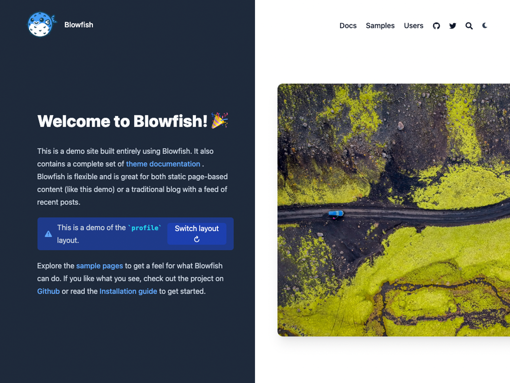
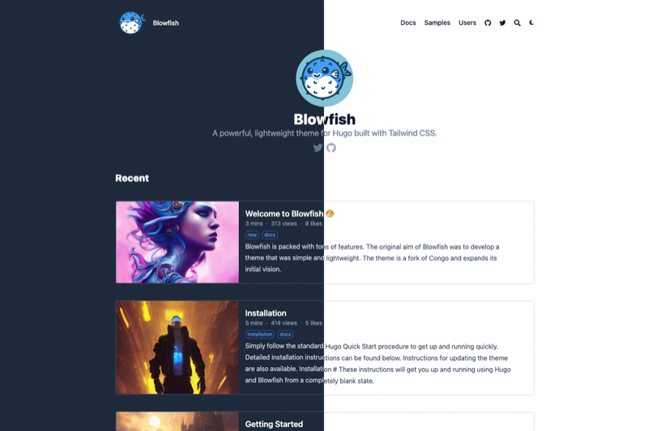

Blowfish fornisce un layout della home page completamente flessibile. Sono disponibili due modelli principali tra cui scegliere con impostazioni aggiuntive per adattare il design. In alternativa, puoi anche fornire il tuo modello e avere il controllo completo sul contenuto della home page.

Il layout della home page è controllato dall'impostazione `homepage.layout` nel file di configurazione `params.toml`. Inoltre, tutti i layout hanno la possibilità di includere un elenco di [articoli recenti](#recent-articles).

## Profile layout

Il layout predefinito è quello del profilo, ideale per i siti web e i blog personali. Mette i dettagli dell'autore in primo piano, fornendo un'immagine e i link ai profili sociali.

Le informazioni sull'autore sono fornite nel file di configurazione delle lingue. Fare riferimento alle sezioni [Guida introduttiva]() e [Configurazione della lingua]() per i dettagli sui parametri.

Inoltre, qualsiasi contenuto Markdown fornito nel contenuto della homepage sarà collocato sotto il profilo dell'autore. Ciò consente una maggiore flessibilità per la visualizzazione di una biografia o di altri contenuti personalizzati utilizzando gli shortcode.

Per abilitare il layout del profilo, impostare `homepage.layout = “profile”` nel file di configurazione `params.toml`.

## Page layout

Il layout di pagina è semplicemente una normale pagina di contenuto che visualizza il contenuto Markdown. È ottimo per i siti web statici e offre una grande flessibilità.

Per abilitare il layout di pagina, impostare `homepage.layout = “page”` nel file di configurazione `params.toml`.

## Hero layout

Il layout hero riunisce le idee dei layout profilo e scheda. Questo non solo mostra le informazioni sull'autore del sito, ma carica anche il markdown sotto di esso.

Per abilitare il layout Hero, impostare `homepage.layout = “hero”` e `homepage.homepageImage` nel file di configurazione `params.toml`.

## Background layout

Il layout di sfondo è una versione più fluida del layout Hero. Come nel layout Hero, anche in questo caso vengono visualizzate le informazioni sull'autore del sito e viene caricato il markdown sotto di esso.

Per abilitare il layout di sfondo, impostare `homepage.layout = “background”` e `homepage.homepageImage` nel file di configurazione `params.toml`.

## Card layout

Il layout delle schede è un'estensione del layout di pagina. Offre lo stesso livello di flessibilità, visualizzando anche i contenuti markdown e aggiungendo un'immagine per visualizzare i contenuti visivi.

Per abilitare il layout a scheda, impostare `homepage.layout = “card”` e `homepage.homepageImage` nel file di configurazione `params.toml`. 

## Custom layout

Se i layout integrati della homepage non sono sufficienti per le vostre esigenze, avete la possibilità di creare un layout personalizzato. Questo permette di avere un controllo totale sul contenuto della pagina e fornisce essenzialmente una lavagna vuota con cui lavorare.

Per abilitare il layout personalizzato, impostare `homepage.layout = “custom”` nel file di configurazione `params.toml`.

Con il valore di configurazione impostato, creare un nuovo file `custom.html` e collocarlo in `layouts/partials/home/custom.html`. Ora tutto ciò che è contenuto nel file `custom.html` sarà collocato nell'area dei contenuti della homepage del sito. È possibile utilizzare qualsiasi funzione HTML, Tailwind o Hugo per definire il layout.

Per includere [articoli recenti](#recent-articles) nel layout personalizzato, utilizzare il partial `recent-articles/main.html`.

Ad esempio, la [homepage]() di questo sito utilizza il layout personalizzato per consentire di passare dal layout del profilo a quello della pagina. Visitare il [repo GitHub](https://github.com/nunocoracao/blowfish/blob/main/exampleSite/layouts/partials/home/custom.html) per vedere come funziona.

## Articoli recenti

Tutti i layout delle homepage hanno la possibilità di visualizzare gli articoli recenti sotto il contenuto della pagina principale. Per attivarla, è sufficiente impostare l'opzione `homepage.showRecent` a `true` nel file di configurazione `params.toml`.

Gli articoli elencati in questa sezione sono derivati dall'impostazione `mainSections`, che consente di utilizzare i tipi di contenuto del sito web. Per esempio, se si hanno sezioni di contenuto per _post_ e _progetti_, si può impostare questa impostazione su `[“post”, “progetti”]` e tutti gli articoli di queste due sezioni saranno utilizzati per popolare l'elenco dei recenti. Il tema si aspetta che questa impostazione sia un array, quindi se si utilizza una sola sezione per tutti i contenuti, è necessario impostarla di conseguenza: `[“blog”]`.

## Thumbnails

Blowfish è stato creato in modo che sia facile aggiungere supporto visivo ai tuoi articoli. Se hai familiarità con la struttura dell'articolo di Hugo, devi solo inserire un file immagine (quasi tutti i formati sono supportati ma consigliamo `.png` o `.jpg`) che inizi con `feature*` all'interno della cartella dell'articolo. E questo è tutto, Blowfish sarà quindi in grado di utilizzare l'immagine sia come miniatura all'interno del tuo sito web sia per le schede <a target="_blank" href="https://oembed.com/">oEmbed</a> su piattaforme sociali.

[Qui]() si trova una guida con maggiori informazioni e un [sample]() se si vuole vedere un esempio.

## Card Gallery

Blowfish supporta anche la visualizzazione degli elenchi standard di articoli come gallerie di schede. È possibile configurare questo sia per la sezione recente nella homepage che per gli elenchi di articoli nel sito web. Per la homepage si può usare `homepage.cardView` e `homepage.cardViewScreenWidth`; per gli elenchi si può usare `list.cardView` e `list.cardViewScreenWidth`. Per maggiori dettagli, consultare i [docs di configurazione] () e la homepage per una dimostrazione dal vivo.
