Just one year ago, I created[Blowfish](https://blowfish.page/), a [Hugo](https://gohugo.io/) theme crafted to build my unique vision for my personal homepage. I also decided to make it an open-source project. Fast-forward to today, and Blowfish has transformed into a thriving open-source project with over 600 stars on GitHub and a user base of hundreds. In this tutorial, I’ll show you how to get started and have your website running in a couple of minutes.



## TL;DR

The goal of this guide is to walk a newcomer to Hugo on how to install, manage, and publish your own website. The final version of the code is available in this [repo](https://github.com/nunocoracao/blowfish-tutorial/tree/main) - for those that would like to jump to the end. 

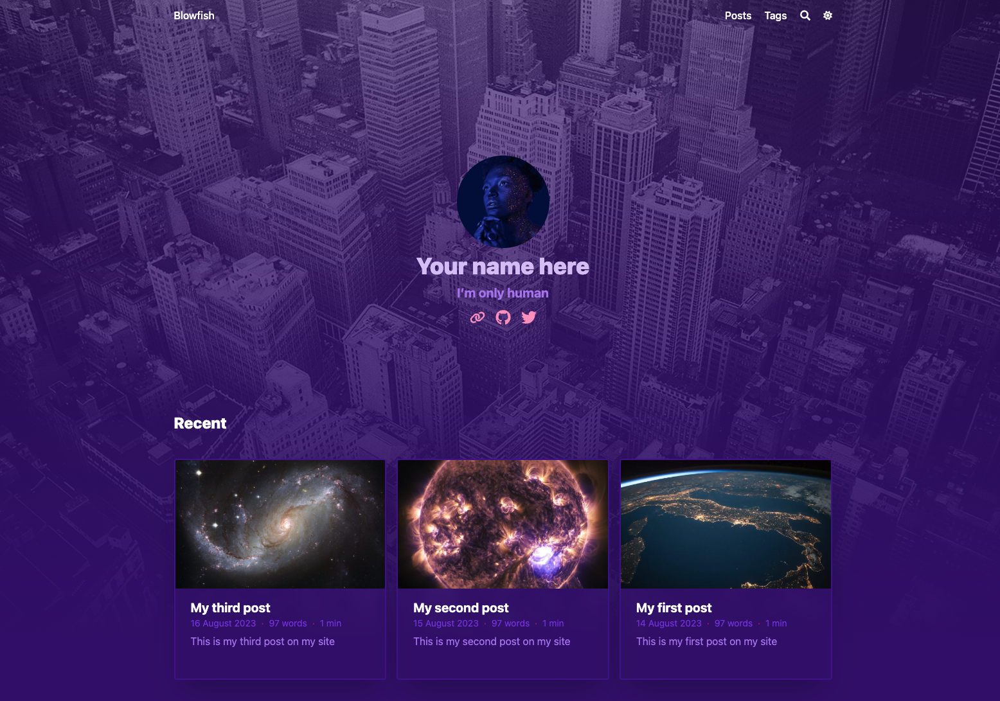

The visual style is just one of the many possibilities available in Blowfish. Users are encouraged to check the [documentation page](https://blowfish.page/) and learn how to customize the theme to their needs. Additionally, there are already [great examples](https://blowfish.page/users/) of the theme from other users available for inspiration. Blowfish also offers several extra features in the form of `shortcodes` available out of the box in the theme - check them out [here](https://blowfish.page/docs/shortcodes/) and get inspired. 

## Setup your environment

Let’s begin by installing all the tools you need. This guide will cover the steps for Mac so these instructions might not apply to your hardware and OS. If you are on Windows or Linux, please consult the guides on how to [install Hugo](https://gohugo.io/installation/), and [GitHub’s CLI](https://cli.github.com/) for your OS.

Anyway, if you are using MacOS let’s install `brew` - a package manager for mac - as that will help installing and managing the other tools.

```bash
/bin/bash -c "$(curl -fsSL https://raw.githubusercontent.com/Homebrew/install/HEAD/install.sh)"
```

Once `brew` is installed let’s install Git, Hugo and GitHub’s CLI.
```bash
brew install git
brew install hugo
brew install gh
```

Create a folder for your code and open a terminal session into it (I chose _blowfish-tutorial_ in the commands below, feel free to call the folder whatever you want).
```bash
mkdir blowfish-tutorial
cd blowfish-tutorial
```

Once inside the folder, the next step is to initialize your local `git`  repo.
```bash
git init -b main
```

Now, let’s create and sync the local repo to a GitHub repo so that your code is stored remotely.
```bash
gh auth login
gh repo create
git push --set-upstream origin main
```

Check the image below for the options I selected for this guide, again feel free to change names and description to your use-case.

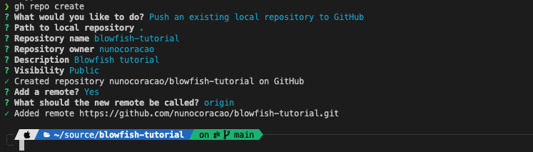


Finally, create a **.gitignore** file which allows you to exclude certain files from your repo automatically. I would start with something like the example below.

```bash
#others
node_modules
.hugo_build.lock

# OS generated files
.DS_Store
.DS_Store?
._*
.Spotlight-V100
.Trashes

# Hugo
public
```

The last step is to save all the changes to the repo.
```bash
git add .
git commit -m “initial commit”
git push
```


## Create site and configure it

With all the tools ready, creating and configuring your site will be easy. Still within the folder you created in the last section, let’s create an empty Hugo website (_with no theme_).

```bash
hugo new site --force .
```

Once the scaffolding finishes, try the command below to run your page. Open a browser on _[https://localhost:1313](https://localhost:1313)_ to see your site…
 
```bash
hugo server
```

 Ups… Page not found – right? 
This was expected, even though you created a website, Hugo doesn’t give any default experience – aka your site doesn’t have any page to show.  

Next step, let's install Blowfish using `git submodules` which will make it easier to manage and upgrade to new versions in the future.
 
```bash
git submodule add -b main https://github.com/nunocoracao/blowfish.git themes/blowfish
```

Next, create the following folder structure at the root of your code directory - `config/_default/`. Now you will need to download [these files](https://github.com/nunocoracao/blowfish/releases/latest/download/config-default.zip) and place them in _\_default_ folder you just created. The final structure should look something like this.

```md
config/_default/
├─ config.toml
├─ languages.en.toml
├─ markup.toml
├─ menus.en.toml
└─ params.toml
`
```


Open the **config.toml** and uncomment the line **theme = "blowfish”** and you are ready to go. Try the running the site again and check the result at _[https://localhost:1313](https://localhost:1313)_

```bash
hugo server
```

You should see something like the image below. Not much yet as we didn’t add any content, but the main skeleton for Blowfish is already in place - just requires configuration. 

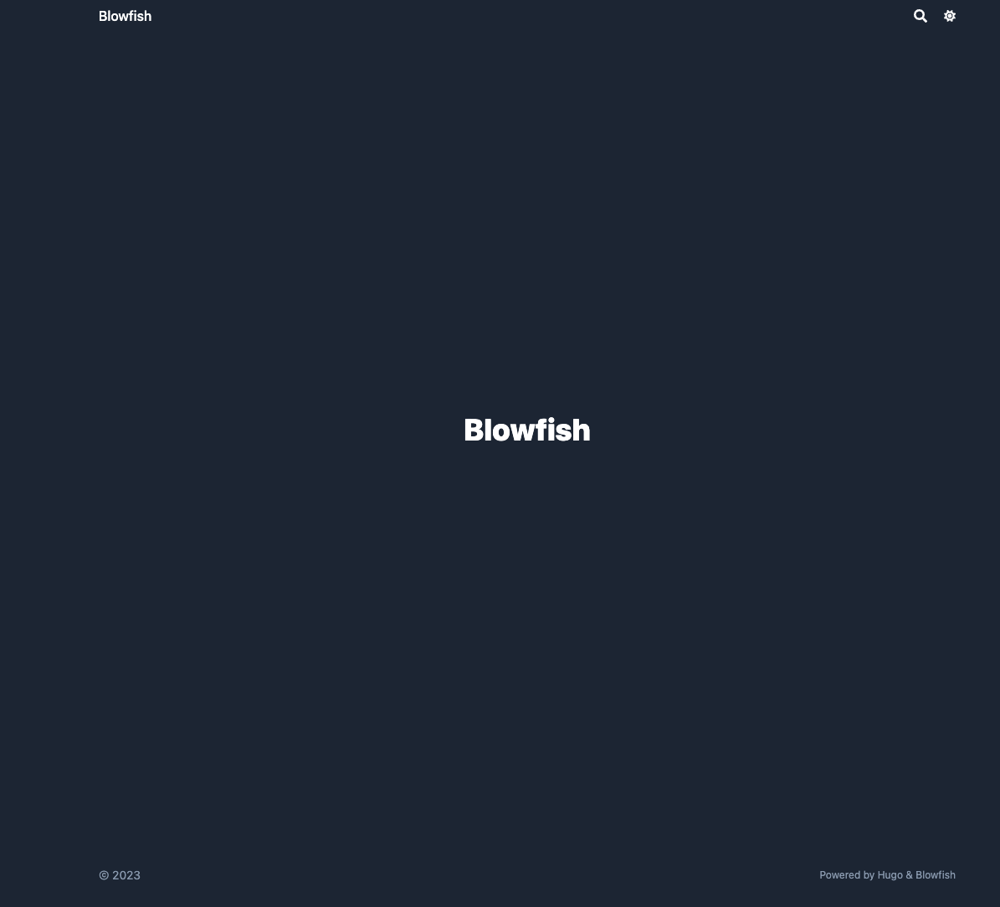

Now let’s configure the theme. 


**FYI** This guide will not cover in detail what each parameter available in Blowfish does – for everything available and how to use it, check [Blowfish documentation](https://blowfish.page/docs/configuration/#theme-parameters) for every option in every file.


### menus.en.toml
This file defines your menu structure, for the top banner and the footer. For this guide, let’s create two menu sections: one for _Posts_ and one for _Tags_. 
- **Posts** - will display the full list of entries
- **Tags** - automatically generated based on tags placed on each article

To achieve this, make sure the following entries exist in the **menus.en.toml** file. Once the changes are done, you should see the menus appearing by re-running **hugo server**.

```toml
[[main]]
  name = "Posts"
  pageRef = "posts"
  weight = 10

[[main]]
  name = "Tags"
  pageRef = "tags"
  weight = 30
```


### languages.en.toml

This file will configure your main details as the author of the website. Change the section below to reflect your details.

```bash
[author]
   name = "Your name here"
   image = "profile.jpg"
   headline = "I'm only human"
   bio = "A little bit about you" # appears in author card for each article
```

The images for the website should be placed in the _assets_ folder. For this step, please add a profile picture to that folder named _profile.jpg_ or change the configuration above to the filename you chose. If you don’t have a profile image available, you can use the one below for the tutorial.


The last step is configuring your links – social media, GitHub, etc. The file includes all the supported options, but they are commented. You are welcome to uncomment everything and delete the ones you would rather not use. Replace the right links on the ones you decided to keep. You can also change the order.


### params.toml

This is the main configuration file for Blowfish. Most of the visual options or customization available can be configured using it, and it covers several areas of the theme. For this tutorial, I decided to use a **background** layout - [check other layouts for Blowfish’s landing page](https://blowfish.page/) - with the **Neon** color scheme - you can pick a different color scheme if you want to - check [this list](https://blowfish.page/docs/getting-started/#colour-schemes) or [create your own](https://blowfish.page/docs/advanced-customisation/#colour-schemes).

Add an **image.jpg** to the assets folder which will be the background for the site. You can also download the examples I am using in this tutorial.


Now let’s jump into the _params.toml_ and start configuring the file. I will focus only on the values that need to be changed, don’t delete the rest of the file without reading the docs. Let’s begin by making sure that we have the right color scheme, that image optimization is on, and configure the default background image.

```bash
colorScheme = "neon"
disableImageOptimization = false
defaultBackgroundImage = "image.jpg" # used as default for background images 
```

Next, let's configure our homepage. We’re going with the _background_ layout, configuring the homepage image and recent items. Furthermore, we are using the **card view** for items in the recent category. Finally, let’s configure the header to be fixed.

```bash
[homepage]
  layout = "background" # valid options: page, profile, hero, card, background, custom
  homepageImage = "image.jpg" # used in: hero, and card
  showRecent = true
  showRecentItems = 6
  showMoreLink = true
  showMoreLinkDest = "/posts/"
  cardView = true
  cardViewScreenWidth = false
  layoutBackgroundBlur = true # only used when layout equals background

[header]
  layout = "fixed"
```

Now configure how the article and list pages will look. Here are the configurations for those. 

```bash
[article]
  showHero = true
  heroStyle = "background" 
  showSummary = true
  showTableOfContents = true
  showRelatedContent = true
  relatedContentLimit = 3

[list]
  showCards = true
  groupByYear = false
  cardView = true
```


If you run **hugo server** again, you should see something like the image below.


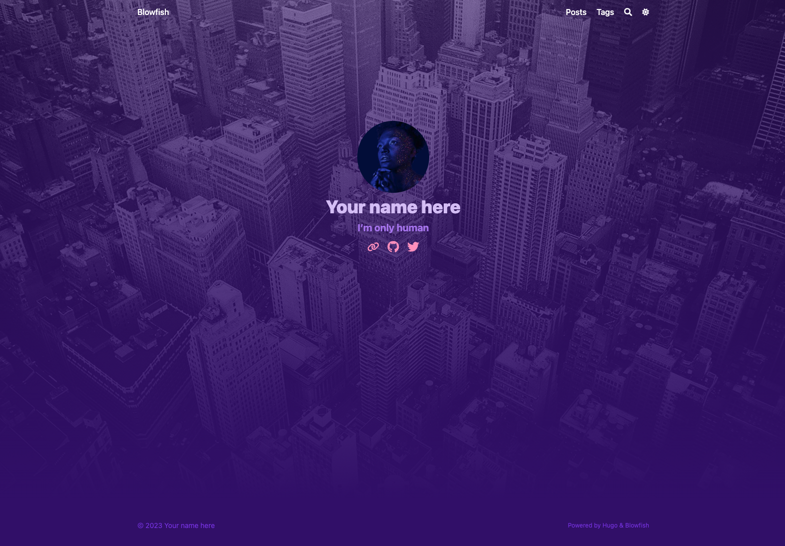


## Adding content to your site

Create a folder to place your posts in  `/content/posts`. This was also the directory configured in your menu to list all the articles. Within that folder, let’s create a new directory and give it the name **myfirstpost**. Within it create an **index.md** file – your article and place a featured.jpg or .png for in the same directory as the thumbnail for the article. Use the example below to get started. The first lines in the file are the Front Matter, which tell Hugo what the look and experience of the article will be – different themes support different params for this. Check the [docs](https://blowfish.page/docs/front-matter/) for more info.

```md
---
title: "My first post"
date: 2023-08-14
draft: false
summary: "This is my first post on my site"
tags: ["space"]
---

## A sub-title

Lorem ipsum dolor sit amet, consectetur adipiscing elit. Morbi nibh nisl, vulputate eu lacus vitae, maximus molestie libero. Vestibulum laoreet, odio et sollicitudin sollicitudin, quam ligula tempus urna, sed sagittis eros eros ac felis. In tristique tortor vitae lacinia commodo. Mauris venenatis ultrices purus nec fermentum. Nunc sit amet aliquet metus. Morbi nisl felis, gravida ac consequat vitae, blandit eu libero. Curabitur porta est in dui elementum porttitor. Maecenas fermentum, tortor ac feugiat fringilla, orci sem sagittis massa, a congue risus ipsum vel massa. Aliquam sit amet nunc vulputate, facilisis neque in, faucibus nisl.
```

You can create additional articles to see what your site will look like once there is content in it. Your site should look like the images below. The main page shows the recent articles, each article is connected through others automatically via related section, you have tag aggregation, and full-text search. 


  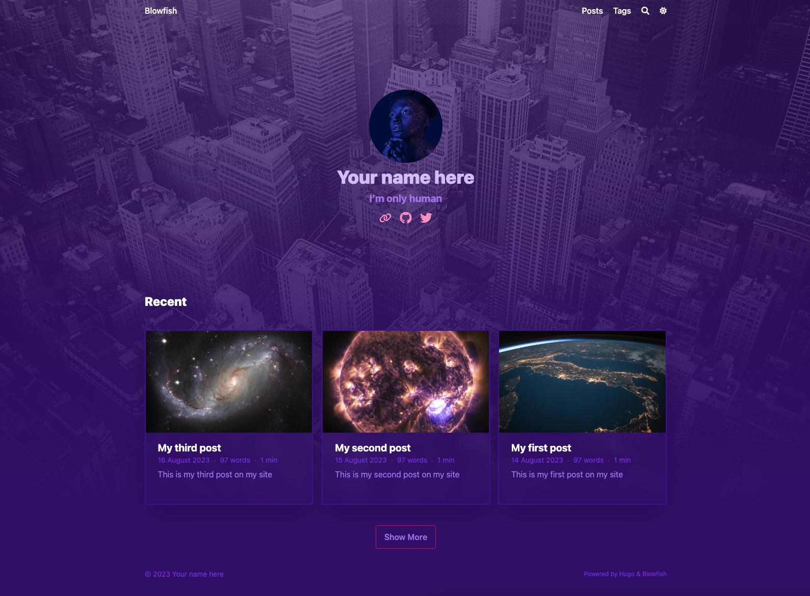
  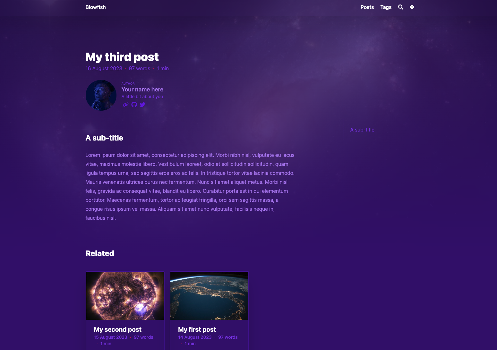
  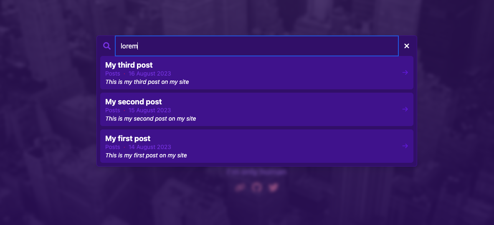
  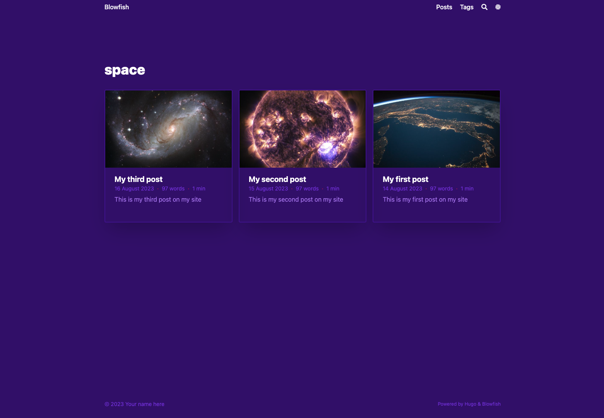



## Ship it

The only thing missing is to ship your site. I will be using [Firebase](https://firebase.google.com/) for hosting - it’s a free alternative and provides more advanced features if you are creating something more complex. Go to firebase and create a new project. Once that is done, let’s switch to the CLI as it will make it easier to configure everything.

Let’s install firebase’s CLI - if not on Mac check [install instructions on Firebase](https://firebase.google.com/docs/cli).
```bash
brew install firebase
```

Now log in and init firebase hosting for the project.

```bash
firebase login
firebase init
```

Select hosting and proceed.

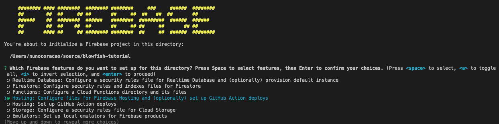

Follow the image below for the options I recommend. Make sure to set up the workflow files for GitHub actions. These will guarantee that your code will be deployed once there is a change to the repo.

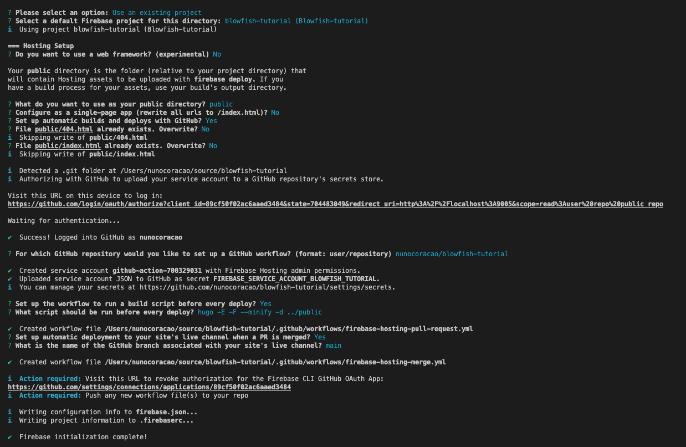

However, those files will not work out-of-box, as Hugo requires extra steps for the build to work. Please copy and paste the code blocks below to the respective files within the **.github** folder, but keep the original **projectId** in the files generated by firebase.

### firebase-hosting-merge.yml
```yaml
# This file was auto-generated by the Firebase CLI
# https://github.com/firebase/firebase-tools

name: Deploy to Firebase Hosting on merge
'on':
  push:
    branches:
      - main
jobs:
  build_and_deploy:
    runs-on: ubuntu-latest
    steps:
      - name: Hugo setup
        uses: peaceiris/actions-hugo@v2.6.0
        env:
          ACTIONS_ALLOW_UNSECURE_COMMANDS: 'true'

      - name: Check out code into the Go module directory
        uses: actions/checkout@v4
        with:
          submodules: true  # Fetch Hugo themes (true OR recursive)
          fetch-depth: 0    # Fetch all history for .GitInfo and .Lastmod

      - name: Build with Hugo
        env:
          # For maximum backward compatibility with Hugo modules
          HUGO_ENVIRONMENT: production
          HUGO_ENV: production
        run: hugo -E -F --minify -d public

      - name: Deploy Production
        uses: FirebaseExtended/action-hosting-deploy@v0
        with:
          repoToken: '${{ secrets.GITHUB_TOKEN }}'
          firebaseServiceAccount: '${{ secrets.FIREBASE_SERVICE_ACCOUNT_BLOWFISH_TUTORIAL }}'
          channelId: live
          projectId: blowfish-tutorial

```


### firebase-hosting-pull-request.yml
```yaml
# This file was auto-generated by the Firebase CLI
# https://github.com/firebase/firebase-tools

name: Deploy to Firebase Hosting on PR
'on': pull_request
jobs:
  build_and_preview:
    if: '${{ github.event.pull_request.head.repo.full_name == github.repository }}'
    runs-on: ubuntu-latest
    steps:
      - name: Hugo setup
        uses: peaceiris/actions-hugo@v2.6.0
        env:
          ACTIONS_ALLOW_UNSECURE_COMMANDS: 'true'

      - name: Check out code into the Go module directory
        uses: actions/checkout@v4
        with:
          submodules: true  # Fetch Hugo themes (true OR recursive)
          fetch-depth: 0    # Fetch all history for .GitInfo and .Lastmod

      - name: Build with Hugo
        env:
          # For maximum backward compatibility with Hugo modules
          HUGO_ENVIRONMENT: production
          HUGO_ENV: production
        run:  hugo -E -F --minify -d public

      - name: Deploy preview
        uses: FirebaseExtended/action-hosting-deploy@v0
        with:
          repoToken: '${{ secrets.GITHUB_TOKEN }}'
          firebaseServiceAccount: '${{ secrets.FIREBASE_SERVICE_ACCOUNT_BLOWFISH_TUTORIAL }}'
          expires: 30d
          channelId: preview-${{ github.event.number }}
          projectId: blowfish-tutorial
```


The last step is committing your code to GitHub and let the workflows you created take care of deploying your site. Since we configured GitHub actions, this will trigger a job that will configure and deploy your site automatically.

```bash
git add .
git commit -m "add github actions workflows"  
git push  
```

If the actions tab for your repo, you should see something like this.

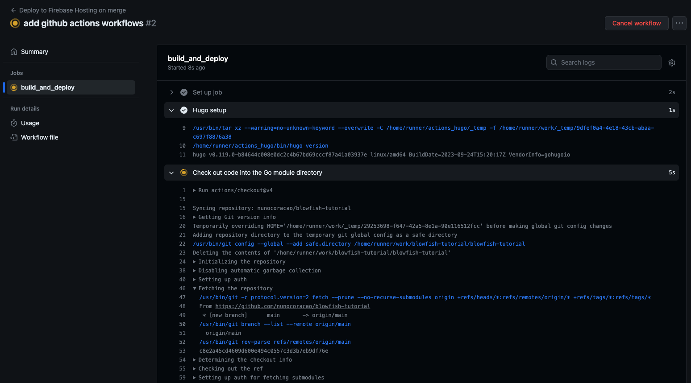

Once all the steps finish, your Firebase console should show something like the image below - including the links to see your app – I got a version of this tutorial running on [https://blowfish-tutorial.web.app/](https://blowfish-tutorial.web.app/).

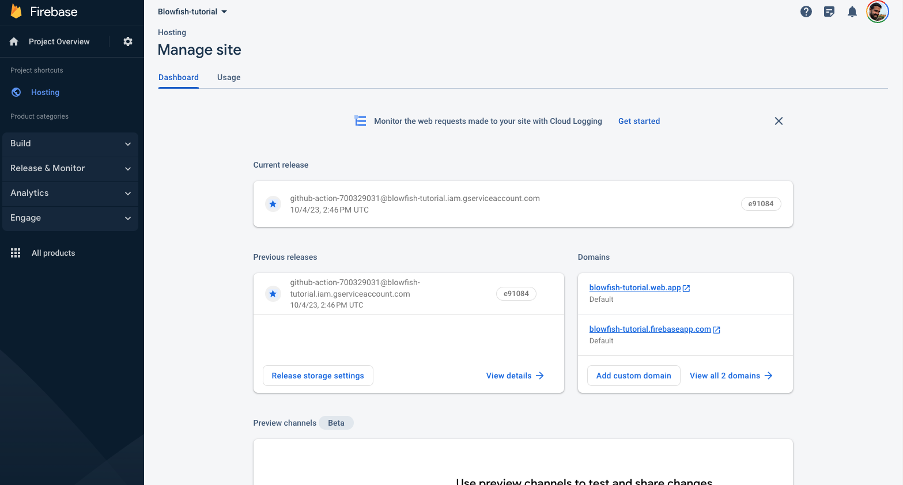


## Conclusion and Next Steps

Now you have your first version of your homepage. You can make changes locally and once you commit your code they will automatically be reflected online. What shall you do next? I’ll leave you with some useful links to get you inspired and learn more about Blowfish and Hugo. 

- https://blowfish.page/docs/
- https://blowfish.page/docs/configuration/
- https://blowfish.page/docs/shortcodes/
- https://blowfish.page/examples/
- https://blowfish.page/users/
- https://gohugo.io/documentation/


