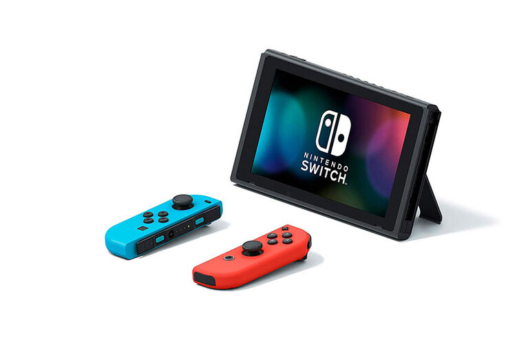

Nintendo achieved something truly amazing with the launch of the Switch. It was able to disrupt itself and the entire gaming industry while saving itself from doom. How exactly was Nintendo able to do it and what comes next in that story?

## A Little History...

Nintendo is a Japanese multinational consumer electronics and video game company with headquarters in Kyoto, Japan. In its annual report for 2021, the company reported a revenue of $16 billion (¥1,759 trillion) and it currently employs around six thousand people around the world across several different business units. 

Nintendo was founded in 1889 as a company that produced and distributed hanafuda, a traditional Japanese card game. During the first half of the 1900s, the company tried to diversify into several different markets with little to no success (e.g. instant rice, love hotels, and a taxi service). During the 60s to 80s, Nintendo started investing in games, electronic toys, and gaming entertainment.

All of these investments culminated in the 90s with the launch of the Super Nintendo Entertainment System which sold around 50 million units worldwide and helped the company enter the US market. By then Nintendo had built several valuable assets in hardware, software, and intellectual property (including the most famous plumber that ever lived, Mario).

After the Super Nintendo, the company continued to release new games and gaming devices throughout the 90s and into the 00s, including the Gameboy, Nintendo 64, GameCube, and the Wii in 2006, which contributed to make Nintendo a force to be reckoned in the gaming industry with net sales that peaked at $18 billion in 2009.

In 2010, the previous generation of hardware Wii was approaching the end of its life cycle and coincidentally the company’s annual net sales started dropping. At the end of 2012 the company launched its next-generation gaming console that would replace the Wii, the Wii U. However, the Wii U was a commercial failure and never got a real foothold in the console market selling less than 15 million units worldwide. The platform was described as expensive, confusing and was never able to attract support from either hardcore nor casual customers leading to Nintendo's sales eventually plummeting to just $4 billion in 2017. 

2017 was also the same year the company was able to disrupt itself and the entire gaming industry with the launch of the Nintendo Switch which until today sold more than 89 million units worldwide, led to a reported $16 billion net sales in 2021, and ultimately contributed to save Nintendo and establish it once again as one of the biggest players in the game industry.

## The Switch's Disruption

The Switch entered the market as the first console that was built from the ground up to provide a hybrid experience between mobile and living room gaming (or at least the first one that was actually able to deliver that experience). This hybrid setup allowed Nintendo to create different gaming modes from connecting the Switch to a TV using a dock, to connecting the controls to the main unit and taking it to play on the go. Additionally, the actual remote of the console can be used as two separate controlling devices which allows two players to enjoy a game at once. All these different modes and combinations made the switch a super attractive console for families and casual gamers since it was an affordable and flexible option when compared to the rest of the hardware available.

A problem that Nintendo had to solve was the fact that launching a gaming console entails an interdependency between the actual hardware and its games. Or in other words, a console is only as valuable as the catalog of games available for it. To solve this problem, Nintendo adopted an integrated strategy in order to launch the Switch with a great catalog of games focusing on the same segment that the hardware features of the console were targeting. Nintendo developed several of the initial games and leveraged its valuable intellectual property of characters and stories to sell the Switch i.e. Mario, Zelda, etc. 

The Switch is a traditional example of a new-market disruption. Nintendo was targeting casual gamers (non-consumption for the traditional gaming industry) by offering a product that was inferior when compared to the other consoles in the market using the metrics from that time (graphics power, storage, etc) but superior when using the new set of metrics important to the new segment (fun, flexible, casual, affordable, etc). The fact that the Switch was not a super powerful device led to Sony and Microsoft not seeing Nintendo as a real competitor since their performance metrics were focused on high-end gamers and AAA titles. This created an asymmetric motivation, meaning that the incumbent companies simply conceded that market to Nintendo as it was not interesting for them. Ultimately, Nintendo gained market share with the Switch selling over 80 million units worldwide. At the moment other players still do not have the incentives to compete in that market and even if they did, they would not be able to because neither of them is competing on the same performance metrics as the Switch nor with the same organization and business structure that would allow them to succeed.

In July 2019, Nintendo decided to launch a cheaper version of the product called the Switch Lite, this was a clear example of the company disrupting itself. Namely, Nintendo created a low-end disruption over its own product by creating a cheaper “good enough” product that targets over-served customers of the original Switch. This created a strong foothold on the low-end market for video games which is hard to compete against.

Currently, Nintendo and the Switch are in a phase of sustaining innovation where incremental performance improvements in attributes are provided to the more valuable/demanding customers in the market. The proof of this is the next version of the console, due to launch in October 2021, the Nintendo Switch OLED, which is basically the same as the current Switch with a bigger screen, bigger battery, and more internal storage. This makes complete sense from a strategic point of view, after defining and deploying such a successful product, Nintendo is focusing on a deliberate strategy to grow its market share and meet the needs of its best customers in order to beat the competition, not that there is actually one at the time.

## What's Next for Nintendo and the Switch?

Currently, the Switch is already the 7th best selling console of all time and the 2nd best selling handheld gaming device of all time with 89 million units sold worldwide. Considering just the consoles still in the market, the Switch has already become the number 2 device in just 4 years. 

It is expected that, for the time being, Nintendo will retain its position in the market and keep evolving the Switch and its ecosystem with new incremental improvements. Companies like Sony and Microsoft which are targeting the high-end gamer segment will not be able to compete with Nintendo due to the humongous differences in the structures of their businesses and organization. Moreover, the other organizations also do not have any incentive to try to compete in the same market as Nintendo because, from their point of view, it is a lower margin market than the one they already have which creates an asymmetric motivation for them to flee up, conceding the low-end without fighting over it. Finally, Nintendo will have a huge advantage over new competitors that tackle its segment and it has every motivation to fight the entrance of new players into its space.

However, there are still points that might require course correction to avoid potential future problems. The first one is the lack of traction from other game developers and publishers in respect to the Switch. Looking at the list of the top 10 best-selling games for the platform only 2 were not developed by Nintendo or one of its subsidiaries. The Switch developer experience has a low barrier to entry (each dev kit costing around $450) but there is a 30% “tax” on each game sold taken from the developers/publishers by Nintendo. The company could potentially look at their developer relationships and explore ways to improve the business model to get a bigger catalog of games faster. A couple of examples would be to help promote games via their channels, or the creation of an indie games program to help and promote smaller companies. Ultimately, this means that in order to grow Nintendo needs to move away from its integrated strategy into a specialized one where it focuses on the most important pieces of the system and in delivering it perfectly i.e. the console, the store, and its IP. But for that, it needs to ensure the right level of modularity so that other developers and publishers can thrive in that space.

Another issue with the Switch is the lack of non-gaming applications available in the device that leads to a clash with the main Job-To-Be-Done for the product, “I want entertainment for me and my family”. The Switch has the potential to be the central hub for family entertainment, however, only three video streaming applications are available on the platform: Hulu, Youtube, and Funimation. Working with companies that provide other types of entertainment like Netflix and Disney and helping them launch those services on the Switch would be a great opportunity for Nintendo to improve the feature set of the device and better serve its users. 

Regarding the future, Nintendo is clearly betting on game streaming as a way to move up in the market and disrupt yet again the other players. This would be a great technology to drive the next round of low-end disruption by offering a cheaper way to play AAA games without having to own expensive hardware and upgrade it every one or two years. However, creating its own streaming service might not be the best strategy, Nintendo should look into making its system more modular and potentially partnering with other companies like Google Stadia to get access to streaming capabilities and an existing catalog of games right away. 

Ultimately, the common factor across all of Nintendo’s decisions and actions has been the ability to focus on understanding and delivering against the underlying Job-To-Be-Done for its customers. The company was able to understand that the gaming experience could solve the problem (or “job”) of family or party entertainment as well as the standard problems customers hire a gaming device to solve (i.e. play games). By organizing the entire company around these jobs, Nintendo created the ability to target non-consumption and attract a completely different segment of users to its products. Moreover, by implementing an integrated strategy that delivered new hardware, developed new games, and leveraged family-friendly characters known around the world, Nintendo was able to deliver a perfect solution for the job and completely disrupt the gaming industry. In my view, this relentless focus on the customer and how to best solve its problem is why Nintendo has become a Purpose Brand that focuses on providing great family fun and entertainment using technology.

## References

[Henderson, Rik. “What is Nintendo Switch Cloud Streaming, how does it work and what Cloud Version games are there?” Pocket-Lint](https://www.pocket-lint.com/games/news/nintendo/155391-nintendo-switch-cloud-version-streaming-explained-games-list)

[Herold, Charles. “10 Reasons the Wii U Was a Failure.” Lifewire.](https://www.lifewire.com/reasons-the-wii-u-is-a-failure-2498588)

[Nintendo. “Nintendo Annual Report FY 2021.”](https://www.nintendo.co.jp/ir/pdf/2021/annual2103e.pdf)

[Orland, Kyle. “What the “OLED Model” means for the future of Nintendo Switch.” ARS Technica.](https://arstechnica.com/gaming/2021/07/what-the-oled-model-means-for-the-future-of-nintendo-switch/)

[Peckham, Matt. “19 Things Nintendo's President Told Us About Switch and More.” Time.](https://time.com/4662446/nintendo-president-switch-interview/)

[Statista. “Nintendo's net sales from fiscal 2008 to 2021.”](https://www.statista.com/statistics/216622/net-sales-of-nintendo-since-2008/)

[Wikipedia. “List of best-selling game consoles.”](https://en.wikipedia.org/wiki/List_of_best-selling_game_consoles)

[Wikipedia. “List of best-selling Nintendo Switch video games.”](https://en.wikipedia.org/wiki/List_of_best-selling_Nintendo_Switch_video_games)