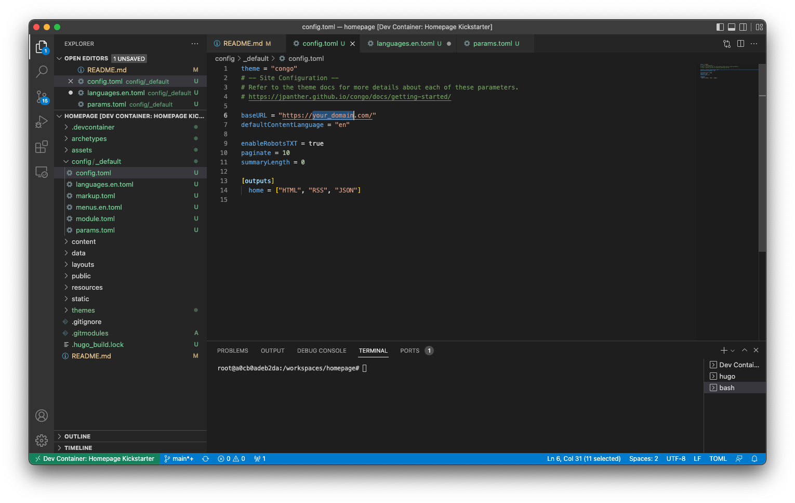
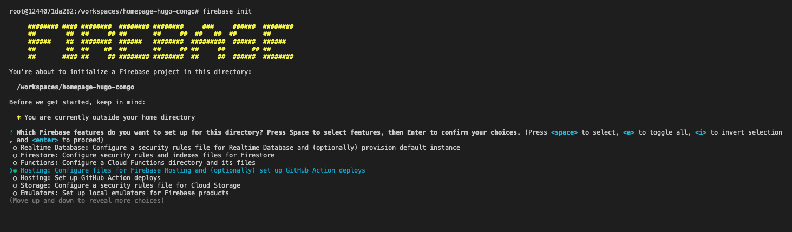

## TL;DR

Currently, there are several solutions to build and host your personal website. I wanted to challenge myself to see if I could do it with the same set of features as some of the paid solutions out there and for free. Here are the results.

## Why would a PM build their own homepage from scratch…

A couple of months ago I decided that I wanted to start writing more in order to a) exercise my writing skills and b) get feedback on some of my ideas. With this goal in mind, I started researching tools/platforms that would help me publish without creating too much friction for me, or for the people wanting to read what I have to say e.g. having to pay. Ultimately I decided upon creating my own website.

I had a couple of reasons for wanting to try this:

- challenge me to see if I, a previous software engineering student, could still bodge something together that would work and feel good about not having forgotten everything I ever learned about programming,

- find a flexible free solution that would allow me to kickstart my website without investing money right away into it, aka avoiding operational costs with platforms and services that would lock me in the future,

- have my content hosted in a place that will not require people to pay for reading it,

- play around with <a target="_blank" href="https://docs.docker.com/desktop/dev-environments/">Docker's developer environments</a> and <a target="_blank" href="https://github.com/microsoft/vscode-dev-containers">Microsoft's developer containers</a> to get myself familiar with both solutions.

## Let’s get started…

After some research, I decided to choose a website generator framework and a free hosting service. For the website framework, I choose <a target="_blank" href="https://gohugo.io">Hugo</a> with <a target="_blank" href="https://github.com/jpanther/congoand">Congo</a> as the theme, and for the hosting service <a target="_blank" href="https://firebase.google.com">Firebase</a>. And for obvious reasons, I decided to set up my development environment using <a target="_blank" href="https://www.docker.com">Docker</a> in order to put myself in the user's shoes for this experiment. 

I didn't go into a deep analysis of which framework was the best for my problem as I wanted to get an MVP out fast so I went through a couple of options and picked the first one that I liked. There are several other options with different features and approaches from the one I picked. If you want to explore other options these are some you can explore: <a target="_blank" href="https://docusaurus.io/">Docussaurus</a>, <a target="_blank" href="https://www.gatsbyjs.com/">Gatsby</a>, <a target="_blank" href="https://jekyllrb.com/">Jekyll</a>, <a target="_blank" href="https://ghost.org/">Ghost</a>, and even <a target="_blank" href="https://wordpress.com/">WordPress</a>. The same is applicable to the hosting part, even though I chose <a target="_blank" href="https://firebase.google.com/">Firebase</a> there are other solutions like <a target="_blank" href="https://pages.cloudflare.com/">Cloudflare Pages</a>, <a target="_blank" href="https://pages.github.com/">GitHub Pages</a>, <a target="_blank" href="https://www.digitalocean.com/">Digital Ocean</a>, <a target="_blank" href="https://www.netlify.com/">Netlify</a>, <a target="_blank" href="https://vercel.com/">Vercel</a>, and others that you might consider exploring. If you have any suggestions for this guide feel free to reach out, always happy to chat and learn.


## Tools

For this guide, I will use the following tools, which should be installed on your machine. Here is a small explanation of what each component is going to be used for and a link to the installation instructions.

- **Docker** - I will use Docker to configure a development environment for this project so that we can skip the need to install all the software required to run Hugo and Firebase CLI i.e. cURL, Go, Hugo, Node, NPM, etc. This will allow you to start from a git repository, start the environment and go straight into writing code instead of spending hours figuring out how to install a specific compiler for your CPU architecture. <a target="_blank" href="https://www.docker.com/get-started/">Install Docker</a>

- **Visual Studio Code** - I'm using Visual Studio Code as my code editor at the moment, and all the material in the guide assumes that this is what you're using. If you have a different preference you’ll need to adapt some parts of this guide to achieve the same results. <a target=”_blank” href="https://code.visualstudio.com/">Install Visual Studio Code</a> 

## Setup the Development Environment

Let's start by configuring your development environment using <a target="_blank" href="https://www.docker.com">Docker</a>. This will allow you to create a container with all the tools you need inside of it without having to mess with your system configurations. Moreover, it will also make it easier to just delete the container and rebuild it whenever you need it instead of keeping old versions of software you don't require daily in your personal machine.


Note: If you just want to clone a repo with the final skeleton feel free to clone <a target="_blank" href="https://github.com/nunocoracao/homepage-hugo-congo">this repo</a> and skip to the deploy section




I'll provide two ways of setting up your development environment feel free to choose the one you prefer or try both to explore the differences between them. Both options rely on a `Dockerfile` built by me which uses `klakegg/hugo:0.93.2-ubuntu` as the base image, even though this is not Hugo's official image (since there isn't one at the moment) it's the one <a target="_blank" href="https://gohugo.io/getting-started/installing/#docker">recommended on their website,</a>.

### Using Docker

To spin up a Dev Environment just open Docker Dashboard and select the "Dev Environments" tab on the left. If you don't have any dev environments setup select "Create New Environment" otherwise use the button on the upper right side "Create". Proceed to the setup step.


Here choose the "Existing Git repo" option and use the following GitHub URL:

```
https://github.com/nunocoracao/homepage-kickstart
```


**Note:** If you clone the repo locally you can also start from the local folder


Once the container is running you should see something similar to the images below.


In both situations, you will be able to see and click the button "Open in VSCode" which will open the editor and will allow you to start working. From there open a terminal and proceed to [create the site skeleton](#create-site-skeleton)

### Using Visual Studio Code

Start by cloning the GitHub repository with the development environment configurations.

```
git clone https://github.com/nunocoracao/homepage-kickstart
```

This method requires the installation of an extra VSCode extension in order to spin up the containers. Please search for **Remote - Containers** and install the extension to continue this guide.

After successfully installing the extension, open your source folder in VSCode and open the “Remote - Containers” extension panel on the left. Select "Open Folder in Container" to spin up a container with the development environment.


Wait a couple of minutes while the image is built. Docker is creating an image with all the required software for the development of the website. This will only happen the first time you spin the environment.


Once the image is built, VSCode will spin the container and will place your working environment inside of it (information available in the bottom left corner of the window). You now have a development environment with Go, Hugo, Firebase CLI, and all the tools you will need for this guide. Just open a new terminal and you’re ready to begin creating your site.


### ...but I really want to run everything locally

If you either prefer or need to run your environment locally follow the guides below to install everything you need for your setup:

- **Homebrew** - <a target="_blank" href="https://brew.sh/">Install homebrew</a>
- **Hugo** - <a target="_blank" href="https://gohugo.io/getting-started/installing/">Install Hugo</a>
- **Node.js and NPM** - <a target="_blank" href="https://nodejs.org/en/download/">Install node.js & NPM</a> (easier to install Firebase CLI)
- **Firebase CLI** - <a target="_blank" href="https://firebase.google.com/docs/cli#install_the_firebase_cli">Install Firebase CLI</a>

## Create Site Skeleton

Now that we have a development environment running the first step is to create the base version of your website. For this let’s use **Hugo** to generate the folder template and configuration files we need by running the following command (`--force` parameter is required to run Hugo on a non-empty directory):

```
hugo new site . --force
```
This should have created a set of folders inside your workspace that you don’t need to worry about for now. The next step is to install a theme for Hugo. I choose <a target="_blank" href="https://github.com/jpanther/congo">Congo</a> as it had all the features I required for my website and it seemed to be easy to change if I ever need it to. If you want to try a different theme there are several available in Hugo’s documentation, each with documentation and examples. 

Install Congo using git submodules by running the following command:

```
git submodule add -b stable https://github.com/jpanther/congo.git themes/congo
```

Now we need to make some changes to the directory and file structure so that Congo can work properly. I will not get into the details of what is happening in this guide (you can consult Congo’s documentation if you want to learn more), the main takeaway is that we’re creating and configuring a folder in <code>config/_default/</code> which will contain all the important configuration files for Hugo and Congo. 

Please run the following commands in order:

```
mkdir -p config/_default
rm config.toml
cp themes/congo/config/_default/*.toml config/_default/
echo 'theme = "congo"' | cat - config/_default/config.toml > temp && mv temp config/_default/config.toml
```

Congratulations, you should have your site up and running now. Let's try it out by running Hugo's debug server:

```
hugo server -D
```

Please open your favorite browser and navigate to <a target="_blank" href="http://localhost:1313">localhost:1313</a> to see your page.


You should see something similar to the image above. Doesn’t look that exciting, does it? Let’s configure the theme in the next sections and learn how to create your first article.


## Configure Theme

Now I’ll be covering how to change the look and feel of your website, add some personal information, and activate the dark mode toggle (aka the most important feature in any website these days). 


A note, I am covering a very simple configuration for this theme please check <a target="_blank" href="https://jpanther.github.io/congo/docs/">Congo’s theme documentation</a> to understand everything you can do with this theme.


### Profile picture

Let’s start by adding a profile picture to your site. Create a folder called “assets” at the root of your project. Choose a profile picture and place it inside the assets folder. The rest of the guide will assume the final picture is named "profile.jpg", so please rename your picture or take that into account when configuring some of the other files. 

<figure>
 	
  <figcaption>If you still need to take a proper awesome picture for this feel free to download this one to proceed with the tutorial.</figcaption>
</figure>


### Configuration Files

Let’s open a couple of configuration files and start updating them. All the files we are going to change are inside <code>config/_default/</code> folder.

#### config.toml

Uncomment the <code>baseURL</code> parameter and replace it with the final domain of your website. This value will be used to create the robots.txt file for any search engines to successfully crawl and index your website.




Note: if you want to configure Google Analytics please add the following line with your id to this file `googleAnalytics = "G-XXXXXX"`



#### languages.en.toml

This file will drive the main information for the website and the author of the page (you). Replace the <code>title</code> and <code>description</code> for the ones you want for your page, these values will drive the HTML title and description tags.

Within the <code>[author]</code> block you can update the details that you wish to highlight in your profile. The bare minimum would be <code>name</code>, <code>image</code>, <code>headline</code>, and <code>links</code>. For the <code>links</code> parameter don't forget to uncomment the last line of the file as this is a json array. Update each entry with your personal links.


#### params.toml

This file defines much of the overall behavior across the entire framework. For this tutorial I changed some of the overall values and one for the homepage, if you want to learn more about the other available configurations please consult <a target="_blank" href="https://jpanther.github.io/congo/docs/">Congo’s theme documentation</a>. 

I've changed <code>colorScheme</code> to "ocean" which changes the global UI theme. Congo defines a three-color palette that is used throughout the theme. Valid values are congo (default), avocado, ocean, fire, and slate. Although these are the default schemes, you can also create your own. Refer to the theme's main documentation to learn how.

Activated <code>showAppearanceSwitcher</code> to enable the light/dark mode toggle. Activated <code>enableSearch</code> which indexes all future posts each time you build the site and provides a simple search feature. I've also changed the value of <code>layout</code>, inside <code>[homepage]</code>, to "profile" which changes the way the landing page is rendered. Finally, the last interesting value here is <code>showRecent</code>, which when turned on shows the recent posts on the homepage.


### Final

Let’s see how it looks, run the Hugo again:

```
hugo server -D
```

And navigate to <a target="_blank" href="http://localhost:1313">localhost:1313</a> you should see something similar to the page below.


Congrats it’s looking great, let’s learn how to generate your first articles.

## How to generate articles

Hugo provides some tools to generate your articles (<a target="_blank" href="https://www.markdownguide.org/">markdown</a> files) with a base set of tags already in them. Run the following command to create your first post

```
hugo new posts/my-first-post.md
```

replace the contents of the file with the following:

```
---
title: "My Published Post"
date: 2022-06-19T20:10:29Z
draft: false
categories: ["published", "test"]
tags: ["first", "awesome"]
---
 
This is my first blog post
```

This just created your first blog post. We've added a couple of categories and tags, which will be indexed by Hugo during build time. These tags will be used to create the Categories and Tags section of the website automatically for you. Notice that I've changed the <code>draft</code> to false to simulate a published post.

Run the following command to create your second post

```
hugo new posts/my-draft-post.md
```
and replace the contents of that file with the following:

```markdown
---
title: "My Draft Post"
date: 2022-06-19T20:20:39Z
draft: true
categories: ["draft", "test"]
tags: ["second", "awesome"]
---
 
This is my second blog post
```
For the second post, I've left the <code>draft</code> parameter true to simulate a draft post.

Hugo automatically hides draft posts from the final site generation. You can keep working on articles leaving the draft label true and they will be ignored by the engine. If you want to run in DEBUG mode just use the command:

```
hugo server -D
```

If you go to the posts on the site you should be able to see both entries. If you then run the server in normal mode the draft articles will disappear. You can use the command below to do so:


```
hugo server
```

You can use this command to test the final version of the website or an article before generating the final build. When you're ready just use the command 'Hugo' to generate the final website inside the /public folder.

```
hugo
```

All files are written in <a target="_blank" href="https://en.wikipedia.org/wiki/Markdown">Markdown</a> which Hugo then uses to generate the final pages. I'll not teach you how to write markdown files in this guide but I can recommend this <a target="_blank" href="https://www.markdownguide.org/getting-started/">"getting started"</a> tutorial and this <a target="_blank" href="https://www.markdownguide.org/cheat-sheet/">"cheat sheet"</a> to get you started. 

## Deploy

Ok, you’ve configured your website and created a couple of articles, but we still need to deploy it somewhere. As I mentioned before I chose Firebase for this guide, even though I know that it offers much more than just a simple hosting service it allows me to host my site for free without much of a hassle.

### Create Firebase Project

Let’s start by going to <a target="_blank" href="https://firebase.google.com">https://firebase.google.com</a> and creating an account. Once that is done you can create a project for free. The process should be straightforward and when you finish you should be in Firebase's project dashboard.

### Setup Firebase

Now you can go back to your environment which already has Firebase CLI tools installed and ready to go. Let’s start by authenticating using:

```
firebase login
```
Once you are successfully logged in you need to initiate the project configurations for firebase. For that please use:

```
firebase init
```

The tool will offer you a wide variety of different options in order to configure your Firebase project. For now, we just want to configure hosting. If you are using GitHub, you might want to consider configuring GitHub action deploys which can automatically build and deploy your site every time there is a push to a specific branch or a merged pull request.



Choose the Firebase project created before as the hosting destination. And select the configurations you wish for the deployment process. The important one here is the folder where the final files to the server will be placed and this is the <code>public</code> folder. For the other parameters you experiment with what better matches your use-case, the image below shows you what I picked (*Note: for this tutorial I didn't configure GitHub actions but I am using that in my real setup*).


### Deploy

Ok, now for the long and boring process of deployment… joking! Once you are ready and have all your files generated by the <code>hugo</code> command in the public folder just use the following command to deploy:

```
firebase deploy
```


The process should take a couple of seconds and there you go your site is deployed. The final line of the CLI tool will give you a URL to see for yourself, otherwise, you can explore your Firebase dashboard hosting section which will have more information regarding the deployment.


## Conclusion

By now you should have a simple version of your website which you can configure to your needs. The main advantage of this solution is that it is flexible and extensible to a variety of different needs especially if you take the time to explore Hugo's theme catalog. True that it might require some coding to implement complex but I would guess that this solves the problem for almost everyone. 

Above all, it’s a completely free solution if you're looking to start and can't (or don't want to) spend money. Hope this guide helps you, feel free to share it with your network and give me feedback so that I can make it better over time. 

## Resources

- <a target="_blank" href="https://github.com/nunocoracao/homepage-kickstart">GitHub Repo for development environment</a>
- <a target="_blank" href="https://github.com/nunocoracao/homepage-hugo-congo">GitHub Repo for base Hugo and Congo configuration</a>
- <a target="_blank" href="https://github.com/nunocoracao/homepage-dockerimage">GitHub Repo for base image</a>
- <a target="_blank" href="https://hub.docker.com/r/nunocoracao/homepage-dockerimage">Docker Hub image URL</a>
- <a target="_blank" href="https://gohugo.io/documentation/">Hugo\'s Documentation</a>
- <a target="_blank" href="https://github.com/jpanther/congo">Congo\'s Documentation</a>
- <a target="_blank" href="https://firebase.google.com/docs">Firebase Documentation</a>
- <a target="_blank" href="https://www.markdownguide.org/">Markdown Guide</a>
- <a target="_blank" href="https://www.markdownguide.org/getting-started/">Markdown Getting Started"</a>
- <a target="_blank" href="https://www.markdownguide.org/cheat-sheet/">Markdown Cheat Sheet</a>